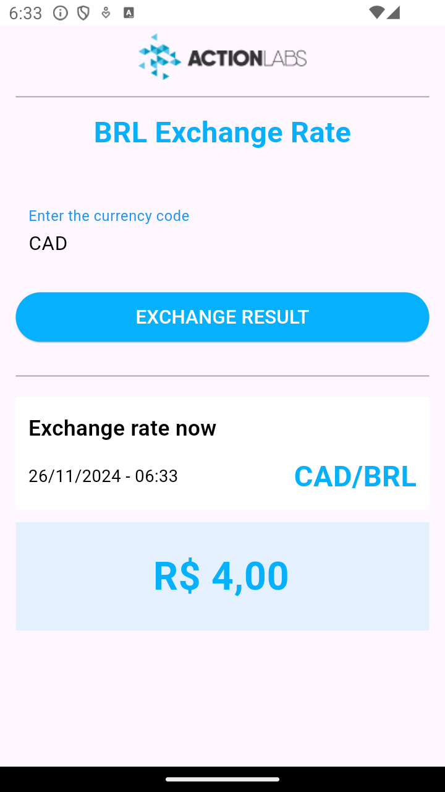

#  Challenge action_labs 🚀
 
##   Sobre o Projeto :construction:

# Exchange Rate App 💵

Este é um aplicativo Flutter que consulta taxas de câmbio para diferentes moedas, utilizando uma API externa. 
O aplicativo permite que o usuário insira o código de uma moeda (por exemplo, "USD" para o dólar americano) e veja a 
taxa de câmbio atual.

## Funcionalidades

- Consulta de taxas de câmbio em tempo real.
- Interface simples com campos de entrada para o código da moeda e exibição dos resultados.
- Exibição de erros caso a requisição à API falhe.

## Pré-requisitos

Antes de rodar o aplicativo, é necessário configurar a chave da API para que a consulta de taxas de câmbio funcione corretamente. 
Para isso, utilizamos o arquivo `.env`.

### Passos para configurar o `.env`

1. Crie um arquivo chamado `.env` na raiz do seu projeto Flutter.

2. No arquivo `.env`, adicione a chave da sua API da seguinte forma:

   ```
   API_KEY=SuaChaveDaAPI
   
   ```

## IDE e versões utilizadas:
Este projeto foi desenvolvido em Android Studio versão:
Ladybug | 2024.2.1 Patch 2 Build #AI-242.23339.11.2421.12550806, built on October 24, 2024

## Arquitetura

Este projeto segue intenções de uma arquitetura inspirada no padrão clean Architecture e clean code, e princípios do S.O.L.I.D.S. Ele é
dividido em camadas para separar as responsabilidades e tornar o código mais organizado e testável.
As principais camadas são:

1. **Presentation Layer**: Responsável pela exibição da interface do usuário. Utiliza widgets e
   componentes Flutter para renderizar as telas.
2. **Domain Layer**: Contém as regras de negócio.
3. **Data Layer**: Responsável por obter dados externos.
   

## :rocket: Tecnologias e libs Utilizadas

- [Dart](https://dart.dev/)
- [Flutter](https://flutter.dev/)
- [Shared Preferences]
- [Dio]
- [getIt] Injeção de dependencias
- [retrofit]
- [Interceptor]
- [Bloc]
- [flutter_dotenv]


## Screenhots
  

## Considerações(A serem implementadas)
Próximas etapas:  testes unitários, goldens testes e componentização.

